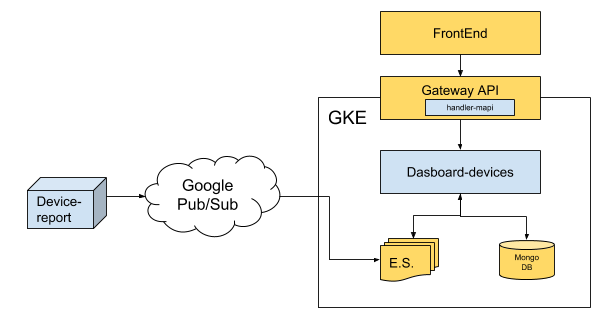
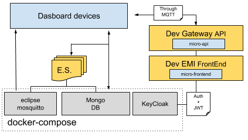

# dashboard devices
The general porpouse of this service is to listen events from the "event store" and create a formatted object to persist in DB to can show by charts the summarized information of the devices connected to the platform.

_This MicroService is built on top of NebulaE MicroService Framework.  Please see the [FrameWork project](https://github.com/NebulaEngineering/nebulae) to understand the full concept_**.



# Table of Contents
  * [Project Structure](#structure)
  * [FrontEnd](#frontend)
    *  [Available charts](#frontend_charts)
    *  [Environment variables](#frontend_env_vars) - not yet available  
  * [API](#api)
    * [GraphQL throught Gateway API](#api_gateway_graphql)
  * [BackEnd](#backend)
    *  [Dasboard devices](#backend_dashboard-devices)
        * [Environment variables](#backend_dashboard-devices_env_vars)
        * [Event Sourcing](#backend_dashboard-devices_eventsourcing)
        * [CronJobs](#backend_dashboard-devices_cronjobs)
  * [Prepare development environment](#prepare_dev_env)

  # Project structure <a name="structure"></a>

```
├── frontend                            => Micro-FrontEnd  
│   └── emi                             => Micro-FrontEnd for [EMI FrontEnd](https://github.com/nebulae-tpm/emi) - not yet available  
├── api                                 => Micro-APIs  
│   └── gateway                         => Micro-API for [Gateway API](https://github.com/nebulae-tpm/gateway)  
├── backend                             => Micro-BackEnds  
│   ├── dashoard-devices                => Micro-BackEnd responsible for listen events useful for dasboard-devices miscroservice 
├── etc                                 => Micro-Service config Files.  
├── deployment                          => Automatic deployment strategies  
│   ├── compose                         => Docker-Compose environment for local development  
│   └── gke                             => Google Kubernetes Engine deployment file descriptors  
│   └── mapi-setup.json                 => Micro-API setup file  
├── .circleci                           => CircleCI v2. config directory
│   ├── config.yml
│   └── scripts
├── docs                                => Documentation resources  
│   └── images  
├── README.md                           => This doc
```
# Frontend <a name="frontend"></a>
Shows by charts the summarized information of the devices connected to the platform and device's transactions. In this webform is possible notice the quantity of devices with alarms in the range of one, two or three hours, to notice about the influx of user (success transactions)  by cueca in the range of one, two or three hours, to notice about the network status (online or offline) of all devices registered on the platform grouped by cuenca, to notice the success transactions Vs failed transactions in a chart grouped by cuenca in range of one, two or three hours.

## Charts available in Frontend <a name="frontend_charts"></a>
These are the exposed the charts available in the webform [Dashboard-devices frontend](https://github.com/nebulae-tpm/ms-dashboard-devices)

### Alarms card charts
There are four card of this type in webpage top, each one belong to CPU usage, RAM memory, Voltage and temperature alarms type. Each one have front and back side, the front side allow us to know the quantity of alarms reported in the timerange selected, the back side allow us to know the top list with the five devices with most quantity of reported alarms and there is a button to navigate to see the complete list.

### Influx of user
This Chart allow at user to know the influx of user in the total system grouped by cuencas in two differents chart located in the front and back side

### Online Vs Offline devices
This chart allow us to know the devices network status agrouped by Cuencas or group name.

### sucess and failed transactions
this chart allow us to know the quantity of sucess and failed transactions in the timerange selected.
# API <a name="api"></a>
Exposed interfaces to send Commands and Queries by the CQRS principles.
The MicroService exposes its interfaces as Micro-APIs that are nested on the general API.

## GraphQL throught Gateway API <a name="api_gateway_graphql"></a>
These are the exposed GraphQL functions throught the [Gateway API](https://github.com/nebulae-tpm/gateway).  

Note: You may find the GraphQL schema [here](api/gateway/graphql/dashboard-devices/schema.gql)

### GraphQL Enums
* DashBoardDevicesAlarmReportTimeRangeType: Refers to the time ranges in [...]
    * ONE_HOUR : Last hour
    * TWO_HOURS: Last two hours
    * THREE_HOURS: Last three hours

* DashBoardDevicesDeviceNetworkStatus: Refers to network status
    * ONLINE: online status
    * OFFLINE: offline status

* DashBoardDevicesAlarmReportType: Refers to different alarm types
    * RAM_MEMORY
    * CPU_USAGE
    * VOLTAGE
    * TEMPERATURE

### GraphQL types
* DashBoardDevicesAlarmReportTopDevices: Top n Devices list for the DashBoardDevicesAlarmReport
    * sn: String! => device Serial Number,
    * hostname: String! => Device hostname
    * alarmsCount: Int! => Number of alarms reported by the device
    * deviceDetailLink: String => Link to navigate to the device info page

* DashBoardDevicesAlarmReportTimeRange : Object used to provide enoght data to each alarm cards
    * timeRange: DashBoardDevicesAlarmReportTimeRangeType! => current time range.
    * alarmsCount: Int! => Total alarms quantity
    * devicesCount: Int! => devices quantity that reports alarms.
    * order: Int! => the priority to show in the selection of timeRange option in the frontend
    * topDevices: [DashBoardDevicesAlarmReportTopDevices] => List of devices with the most quantity of alarms reported in the time range selected
    * fullDevicesListLink: String => not used [deprecated]

* DashBoardDevicesAlarmReport: Object to provide data to alarm card chart.
    * type: DashBoardDevicesAlarmReportType! => Alarm type
    * timeRanges: [DashBoardDevicesAlarmReportTimeRange] => Array with data for each time range
    * queriedTime: BigInt => query timestamp

* DashBoardDevicesNetworkEvent: Device Network status event type used for DashBoardDevices
    * state: DashBoardDevicesDeviceNetworkStatus! => Network status
    * serial: String! => Serial of device
    * hostname: String! => hostname of device
    * cuenca: String! => Cuenca to Device belongs

* DashBoardDeviceNetworkStatusSubSerie: Object used to represent subgroups data on devices online Vs offline chart
    * name: String! => serie name (Online, Offline)
    * value: Int! => serie value (quantity of devices online or offline) 

* DashBoardDeviceNetworkStatus: Object to provide data at device network status chart in DashboardDevices. (online Vs offline) chart
    * name: String! => Cuenca name used to show in devices on Vs devices off chart
    * series: [DashBoardDeviceNetworkStatusSubSerie]! => Custom object type to provide data to chart in DasboardDevice microservice

* DashboardDeviceTransaction: Device transaction
    * interval: BigInt! => 
    * groupName: String => Cuenca name which serves as a grouping criterion
    * transactions: Int! => Success transaction quantity 
    * errors: Int! => failed transaction quantity

* DashboardDeviceTransactionSucess: 
    * name: String! => Group or cuenca name
    * value: Int! => Success transaction quantity

* DashboardDeviceTransactionSucessArray: Object to provide data at influx of user chart
    * timeRange: String! => TimeRange of sucess transaction
    * data: [DashboardDeviceTransactionSucess]! => [...]

* DeviceTransactionsUpdatedEvent: Event that informs when it's necessary to update the device transaction stats
    * timestamp: BigInt! => timestamp

### GraphQL Queries
#### getDashBoardDevicesAlarmReport
* Description : Get a report summary of alarmed devices to provide data to alarm card charts in Dashboard-devices
* Parms:
    * type: DashBoardDevicesAlarmReportType! => Alarm type
    * startTime: BigInt! => query timestamp
* returns : DashBoardDevicesAlarmReport object.

#### getDashBoardDevicesCurrentNetworkStatus
* Description: Get data agrouped by groupName to show in Dashboard Devices online Vs Ofline
* Params : none
* returns : DashBoardDeviceNetworkStatus Array

#### getCuencaNamesWithSuccessTransactionsOnInterval
* Description: get the group names list in wich success transactions were made
* params:
    * startDate: BigInt => lower limit date to search registries in the database
    * endDate: BigInt => higher limit date to search registries in the database
* returns: String array where each string is a group name

#### getSucessDeviceTransactionsGroupByGroupName
* Description: get the sucess transactions grouped by Groupname 
* params: 
    * nowDate: BigInt! => query timestamp
* returns: DashboardDeviceTransactionSucessArray objects array

####  getDeviceTransactionsGroupByTimeInterval
* Description: get the sucess and failed transactions grouped by Groupname
* params:
    * startDate: BigInt => Lower limit date to search registries in the database
    * endDate: BigInt => Higher limit date to search registries in the database
    * groupName: String => GroupName to filter
* returns: DashboardDeviceTransaction objects array

#### getDeviceDashBoardTotalAccount
* Description: get total number of devices registred in the platform
* Params: none
* Return: Integer

### GraphQL Subscriptions
#### onDashBoardDeviceOnlineReported
    Executed when a Device is reported as online
* Data: DashBoardDeviceNetworkStatus object array

#### onDashBoardDeviceOfflineReported
* Description: Executed when a Device is reported as offline
* Data: DashBoardDeviceNetworkStatus object array

#### onDashBoardDeviceCpuUsageAlarmActivated
* Description: Executed when a device reports A CPU usage alarm
* Data: DashBoardDevicesAlarmReport object

#### onDashBoardDeviceRamMemoryAlarmActivated
* Description: Executed when a device reports A RAM memory alarm
* Data: DashBoardDevicesAlarmReport object

#### onDashBoardDeviceTemperatureAlarmActivated
* Description: Executed when a device reports A temperature alarm
* Data: DashBoardDevicesAlarmReport object

#### onDashBoardDeviceLowVoltageAlarmReported
* Description: Executed when a device reports A low voltage alarm
* Data: DashBoardDevicesAlarmReport object

#### onDashBoardDeviceHighVoltageAlarmReported
* Description: Executed when a device reports A high voltage alarm
* Data: DashBoardDevicesAlarmReport object

#### deviceTransactionsUpdatedEvent
* Description: Executed when there is new available data to show in charts about transactions
* Data: DeviceTransactionsUpdatedEvent object

### GraphQL Mutations
    N/A
# BackEnd <a name="backend"></a>
Backends are defined processes within a docker container.  
Each process is responsible to build, run and maintain itself.  

Each BackEnd has the following running commands:
  * npm start: executes main program
  * npm run prepare: execute maintenance routines such DB indexes creation
  * npm run sync-state:  syncs backend state by reading all missing Events from the event-store
  * npm test: runs unit tests

## Dasboard-Devices <a name="backend_dashboard-devices"></a>


### Environment variables <a name="backend_dashboard-devices_env_vars"></a>
All the time, the [devices-report](https://github.com/nebulae-tpm/ms-devices-report/tree/master/backend/devices-report-receptionist) reports events belonging to the different devices registered on the system, these events detail information about the device status.  The Dasboard-Devices backend gathers these events and persists the relevant information for this microservice (Eg. hostname, groupName, alarms, transactions etc). At the end, all of the received information become in three main persisted states: General status of each device, device alarms reported and transactions made.

```
+------------------------------------------+--------+----------------------------------------------------------------------------------------------+-------+-----------+
|                 VARIABLE                 | TYPE   |                                          DESCRIPTION                                         |  DEF. | MANDATORY |
|                                          |        |                                                                                              | VALUE |           |
+------------------------------------------+--------+----------------------------------------------------------------------------------------------+-------+-----------+
| production                               | bool   | Production enviroment flag                                                                   | false |           |
+------------------------------------------+--------+----------------------------------------------------------------------------------------------+-------+-----------+
| EVENT_STORE_BROKER_TYPE                  | enum   | Event store broker type to use.                                                              |       |     X     |
|                                          | string | Ops: PUBSUB, MQTT                                                                            |       |           |
+------------------------------------------+--------+----------------------------------------------------------------------------------------------+-------+-----------+
| EVENT_STORE_BROKER_EVENTS_TOPIC          | enum   | Event store topic's name.                                                                    |       |     X     |
|                                          | string |                                                                                              |       |           |
+------------------------------------------+--------+----------------------------------------------------------------------------------------------+-------+-----------+
| EVENT_STORE_STORE_TYPE                   | enum   | Event store storage type to use.                                                             |       |     X     |
|                                          | string | Ops: MONGO                                                                                   |       |           |
+------------------------------------------+--------+----------------------------------------------------------------------------------------------+-------+-----------+
| EVENT_STORE_STORE_URL                    | string | Event store storage URL or connection string.                                                |       |     X     |
|                                          |        | Eg.: mongodb://127.0.0.1:27017/test                                                          |       |           |
+------------------------------------------+--------+----------------------------------------------------------------------------------------------+-------+-----------+
| EVENT_STORE_STORE_AGGREGATES_DB_NAME     | string | Event store storage database name for Aggregates                                             |       |     X     |
|                                          |        | Eg.: Aggregates                                                                              |       |           |
+------------------------------------------+--------+----------------------------------------------------------------------------------------------+-------+-----------+
| EVENT_STORE_STORE_EVENTSTORE_DB_NAME     | string | Event store storage database name prefix for Event Sourcing Events                           |       |     X     |
|                                          |        | Eg.: EventStore                                                                              |       |           |
+------------------------------------------+--------+----------------------------------------------------------------------------------------------+-------+-----------+
| GOOGLE_APPLICATION_CREDENTIALS           | string | Production only.                                                                             |       |     X     |
|                                          |        | Google service account key path to access google cloud resources.                            |       |           |
|                                          |        |                                                                                              |       |           |
|                                          |        | Eg.: /etc/GOOGLE_APPLICATION_CREDENTIALS/gcloud-service-key.json                             |       |           |
+------------------------------------------+--------+----------------------------------------------------------------------------------------------+-------+-----------+
| LOCKVERSION                              | string | Production only.                                                                             |       |     X     |
|                                          |        | word or phrase used to evaluate if the sync task should be run before starting this backend. |       |           |
|                                          |        | This value must be changed to force state sync task.                                         |       |           |
+------------------------------------------+--------+----------------------------------------------------------------------------------------------+-------+-----------+
| MONGODB_URL                              | string | Materialized views MONGO DB URL                                                              |       |     X     |
|                                          |        | Eg.: mongodb://127.0.0.1:27017/test                                                          |       |           |
+------------------------------------------+--------+----------------------------------------------------------------------------------------------+-------+-----------+
| MONGODB_DB_NAME                          | string | Materialized views MONGO DB name                                                             |       |     X     |
|                                          |        | Eg.: DeviceAlarmReports                                                                  |       |           |
+------------------------------------------+--------+----------------------------------------------------------------------------------------------+-------+-----------+
| JWT_PUBLIC_KEY                           | string | RSA Public key to verify JWT Tokens.                                                         |       |     X     |
|                                          |        | Format: -----BEGIN PUBLIC KEY-----\nPUBLIC_KEY\n-----END PUBLIC KEY-----                     |       |           |
+------------------------------------------+--------+----------------------------------------------------------------------------------------------+-------+-----------+
| REPLY_TIMEOUT                            | number | TimeOut in milliseconds in case of sending data through the broker and waiting the response. |  2000 |           |
+------------------------------------------+--------+----------------------------------------------------------------------------------------------+-------+-----------+
| BROKER_TYPE                              | enum   | Broker type to use for inter-process communication.                                          |       |     X     |
|                                          | string | Ops: PUBSUB, MQTT                                                                            |       |           |
+------------------------------------------+--------+----------------------------------------------------------------------------------------------+-------+-----------+
```
#### Notes: 
  * ENV VARS for development are [here](backend/dashboard-devices/.env)
  * ENV VARS for production are [here](deployment/gke/deployment-dashboard-devices.yaml)

### Event Sourcing <a name="backend_dashboard-devices_eventsourcing"></a>
    Event sourcing events this Micro-BackEnd is subscribed to or is publishing.
#### Subscribed events:    
*   onDashBoardDeviceOnlineReported             : Device reports online networkstatus 
*   onDashBoardDeviceOfflineReported            : Device reports offline networkstatus 
*   onDashBoardDeviceCpuUsageAlarmActivated     : Device reports a Cpu usage alarm
*   onDashBoardDeviceRamMemoryAlarmActivated    : Device reports a RAM memory alarm
*   onDashBoardDeviceTemperatureAlarmActivated  : Device reports a temperature alarm
*   onDashBoardDeviceLowVoltageAlarmReported    : Device reports a low voltage alarm
*   onDashBoardDeviceHighVoltageAlarmReported   : Device reports a high voltage alarm
*   deviceTransactionsUpdatedEvent              : Transaction update from backend 

#### Published events: 
* N/A

### CronJobs <a name="backend_dashboard-devices_cronjobs"></a>
Time-based jobs that are configured and triggered by the [CronJob MicroService](https://github.com/nebulae-tpm/ms-cronjob)

#### Clean DashBoard Devices History
Cleans the alarms and transactions history of each device registered on the system. removes all registries before N hours in transaction and alarms collections, where N is configured on the cronjob properties.
specs:  
  * Event type: CleanDashBoardDevicesHistoryJobTriggered
  * Payload properties: 
     * obsoleteThreshold (int): number of hours needed to consider a record as obsolete to be able to remove it.
# Prepare development environment <a name="prepare_dev_env"></a>




